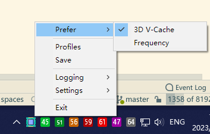

# VCACHE-TRAY

A tray utility to control dynamic CCD preference of heterogeneous AMD 3D V-Cache CPUs like 7950x3D and 7900x3D.

### Requirements

- Install latest BIOS and AMD chipset driver
- Option `CPPC Dynamic Preferred Cores` in BIOS `SMU menu` must be set to `AUTO` or `Driver` to allow OS control via `AMD 3D V-Cache Performance Optimizer` device
  - Otherwise this device will not work and appear in Device Manager
  - ⚠ On ASUS Proart-x670E, BIOS 1202, if `Max Clock Limit` is enabled in `PBO` menu, both BIOS and driver `CPPC prefer CCD` function will not work properly, dunno why.
  
- Recommend to turn off `Game Mode` in Windows, since you are gonna use this utility to control CCD preferences and profiles manually

### How to use

Run it and switch modes via tray icon.

if you need to add more or modify profiles, please edit the `config.json` and restart the utility.

Pass `-h` to check more options, `--alloc_console` to check debug logs.

⚠ Recommend switch the prefer CCD or setup profile firstly before starting new program, it looks like some activated threads will stick on original CCD until they are terminated.

⚠ Only tested on Windows 10 yet.

### How does it work

While I was investigating 3D V-Cache driver and planning to take over control of device, but I found that AMD leaved a registry interface `HKEY_LOCAL_MACHINE\SYSTEM\CurrentControlSet\Services\amd3dvcache\Preferences` to allow change things on the fly. It will take a **while**, like, up to serval minutes to take effect without restarting the 3dvcache service. That's it, this program is just a simple frontend of these registry interfaces.

### Build

Build with msys2 and cmake.

